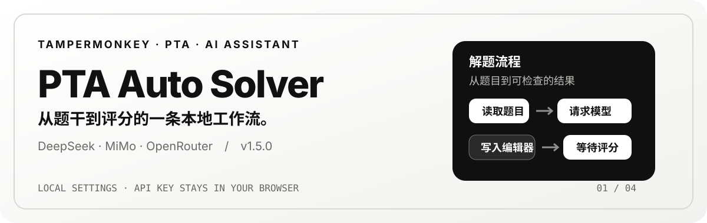
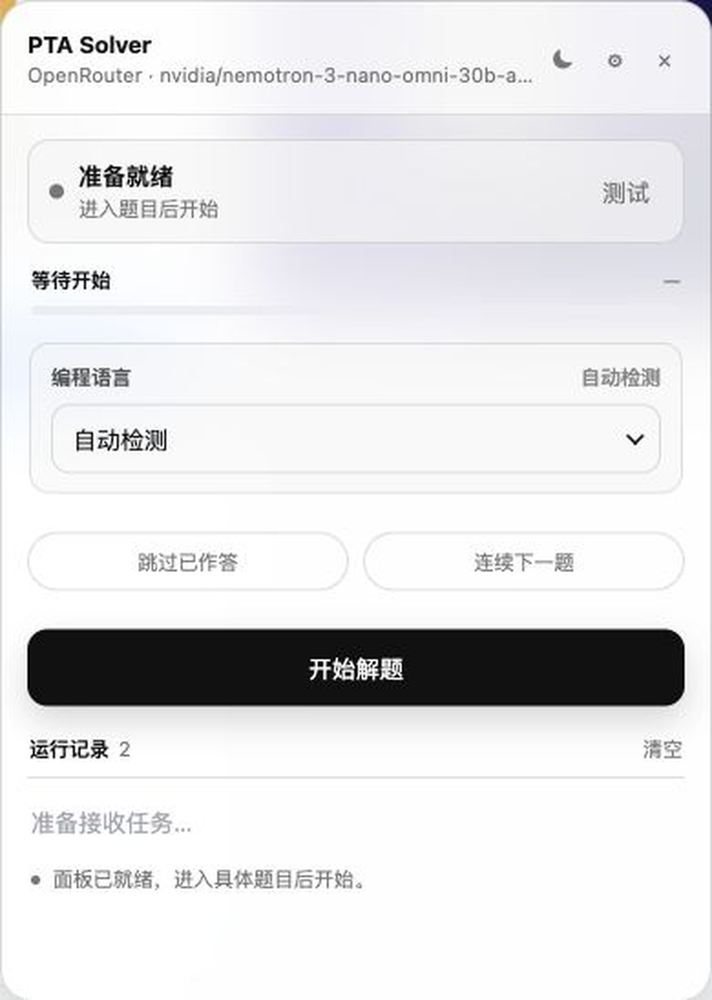
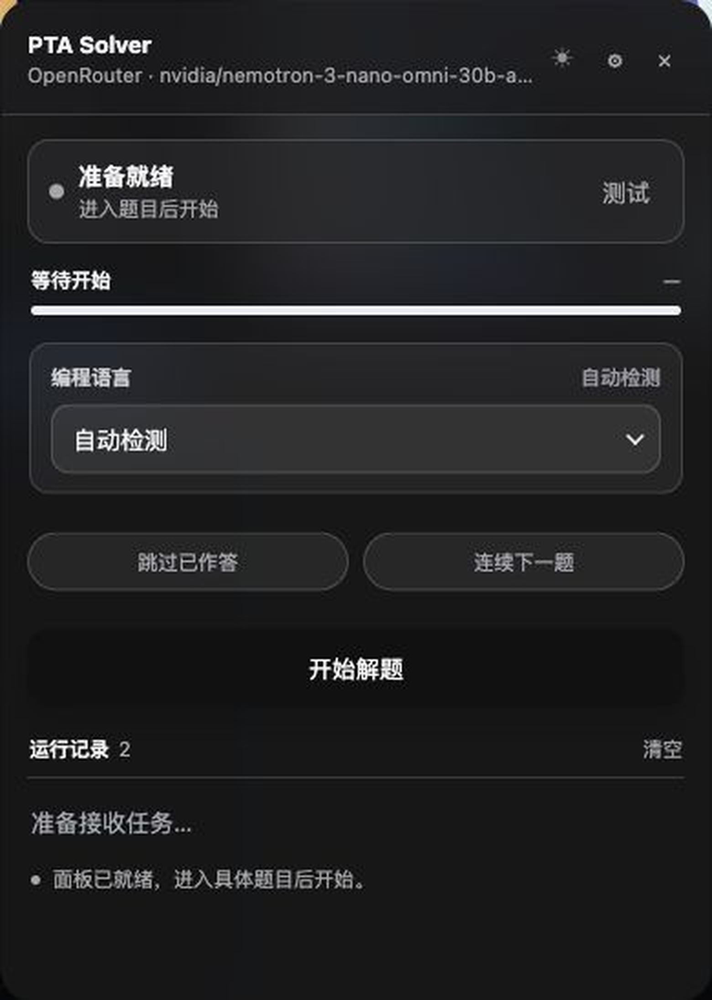
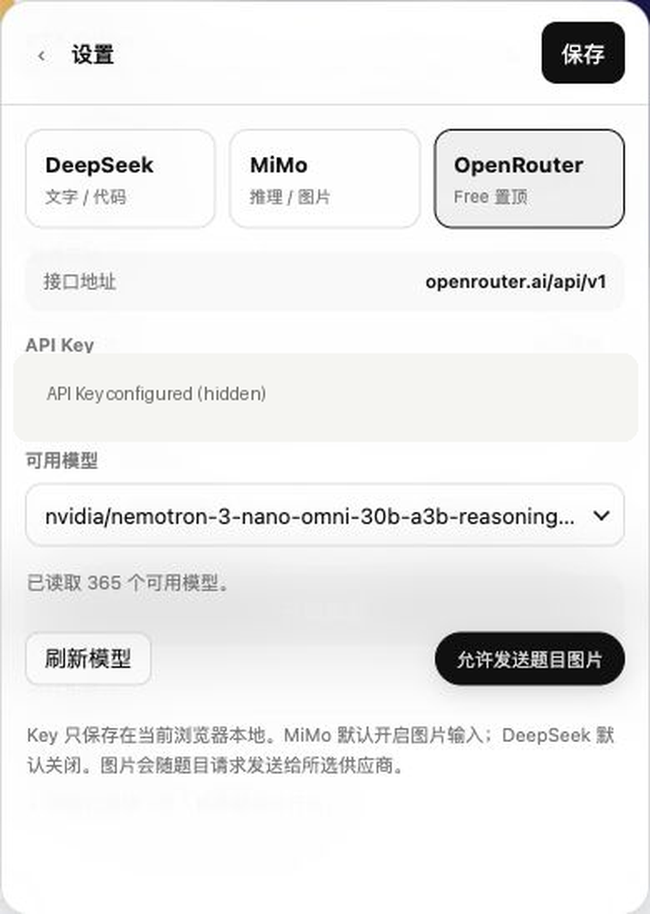
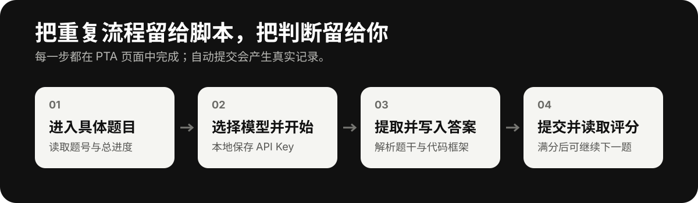

# PTA Auto Solver

  

  <a href="https://neuroncstate.github.io/PTA-Auto-Solver/">项目主页</a> ·
  <a href="./PTA%20Auto%20Solver%20Pro-1.6.0.user.js">安装脚本</a> ·
  <a href="https://github.com/NeuronCState/PTA-Auto-Solver/issues">反馈问题</a>

PTA Auto Solver 是运行在 [拼题 A（PTA）](https://pintia.cn/) 页面上的 Tampermonkey AI 辅助答题脚本，也可作为 PTA 脚本、PTA 自动答题或 PTA 自动刷题工具被检索。它读取当前题目上下文，调用你选择的 AI 供应商，把结果写入 PTA 编辑器，并在提交后读取评分。

> 当前版本：`1.6.0` · 作者：`NeuronCState` · 仅匹配 `https://pintia.cn/*`

## 先看界面

  
  
  

## 它能做什么

- 从具体题目页读取题干、样例、函数接口、代码框架与裁判代码等上下文。
- 支持判断、单选、多选、填空、程序填空、函数题与编程题；多文件编程题尚未接入专用提取流程。
- 为编程题生成代码，写入 PTA 编辑器，提交后等待评分并读取结果。
- 非满分时最多自动重答 1 次；开启“连续答题”后，满分会进入下一题。
- 提供自动检测、C、C++、Python、Java、Pascal 五种语言选择。
- 统一控制脚本面板与 PTA 页面的浅色 / 深色主题，并展示真实题目进度与运行记录。

## 解题流程

  

自动提交会在 PTA 中留下真实提交记录。首次使用建议关闭“连续答题”，先检查生成的代码和评分，再决定是否连续处理。

## 3 分钟开始使用

1. 安装浏览器扩展 [Tampermonkey](https://www.tampermonkey.net/)。
2. 打开 [项目主页](https://neuroncstate.github.io/PTA-Auto-Solver/) 并点击“安装 / 更新脚本”，或直接打开 [PTA Auto Solver Pro-1.6.0.user.js](./PTA%20Auto%20Solver%20Pro-1.6.0.user.js)。
3. 在 Tampermonkey 确认安装，刷新 PTA 页面。
4. 登录 PTA 并进入**具体题目页面**；右下角会出现脚本面板。
5. 点击面板右上角设置，选择供应商、填写 API Key、等待模型列表加载，然后点击“测试”。
6. 在首页确认编程语言与开关，点击“开始解题”。需要停止时点击“停止解题”。

如果浏览器没有自动跳到安装页，可在 Tampermonkey 控制面板选择“添加新脚本”或“导入”，再导入 `.user.js` 文件。

## 模型与配置

| 供应商 | 图片输入默认值 | 鉴权方式 | 特性 |
| --- | --- | --- | --- |
| DeepSeek | 关闭 | Bearer Token | 文字 / 代码 |
| MiMo | 开启 | `api-key` 请求头 | 推理 / 代码 |
| OpenRouter | 关闭 | Bearer Token | 聚合多供应商，Free 模型置顶 |
| OpenCode Free | 关闭 | 本地 Bearer Token（可选） | 自动探测 `127.0.0.1:8788`，仅显示代理返回的 Free 模型 |

模型名称不会固定写死：填写 API Key 后，脚本请求对应的 `/models` 接口并展示可用模型。OpenRouter 的 Free 模型会优先显示，并在名称后标注 `· Free`。启动 OpenCode Free 本地代理后，脚本会自动探测端口并显示该供应商，Token 未设置时可以留空。

API Key 仅保存在当前浏览器的本地配置中；脚本不将 Key 上传到自建服务器，但会按所选供应商 API 的要求发送给该供应商。

### 常用选项

- **跳过已作答**：不处理已经填入答案的题目。
- **连续答题**：本题满分后进入下一题。
- **自动检测语言**：依据题目标题、接口与代码内容判断；也可手动指定 C、C++、Python、Java 或 Pascal。
- **主题切换**：面板顶部月亮 / 太阳按钮会同步切换 PTA 页面、面板、设置抽屉与下拉框主题；选择会在浏览器中保存。

编程题的请求预算为 `32768` tokens，普通题为 `2048` tokens，连接测试为 `256` tokens。

## 支持范围

| PTA 题型 | 支持情况 |
| --- | --- |
| 判断题、单选题、多选题、填空题 | 支持 |
| 程序填空题、函数题、编程题 | 支持 |
| 多文件编程题 | 暂未接入专用提取流程 |

## 常见问题

<strong>模型列表为空</strong>

确认 API Key 完整且供应商选择正确，再点击“刷新模型”。无效 Key 的错误会显示在设置页和运行记录中。

<strong>AI 返回为空或只有推理内容</strong>

部分思考型模型可能消耗大量输出预算，只返回 `reasoning_content` 而没有最终答案。可更换模型或重新测试连接。

<strong>进度一直显示“等待开始”</strong>

请确认打开的是具体题目页而非题目集概览页。脚本从 PTA 题目导航读取总题数和当前题号。

<strong>脚本没有显示</strong>

检查 Tampermonkey 是否启用、网址是否为 `https://pintia.cn/`、页面是否已刷新，以及是否安装了最新版脚本。

<strong>深色模式页面颜色异常</strong>

深色模式会统一处理 PTA 页面，同时尽量保留普通图片和视频的原始观感。个别 PTA 弹层或第三方组件使用独立样式，刷新页面后通常可恢复。

## 权限与验证

脚本使用 `GM_xmlhttpRequest` 请求模型列表和聊天接口，使用 `GM_setClipboard` 在编辑器无法直接写入时复制答案到剪贴板；仅允许连接 `api.deepseek.com`、`api.xiaomimimo.com` 与 `openrouter.ai`。

- JavaScript 语法检查已通过。
- 已在真实 PTA 函数题页验证：代码写入、提交、等待评分、读取 `20 / 20`，以及满分后进入下一题。

## 项目主页与更新

`docs/` 是 GitHub Pages 的静态源文件，发布地址为 <https://neuroncstate.github.io/PTA-Auto-Solver/>。仓库设置中选择 **Settings → Pages → Deploy from a branch → `main` / `/docs`** 即可启用。

如果 Pages 当前选择的是 `main` / `/(root)`，仓库根目录也提供了入口，会自动跳转到 `docs/`。若仍显示 404，请在 **Settings → Pages** 确认已经选择发布源；仅提交网页文件不会自动开启 GitHub Pages。

脚本元数据已配置 `@updateURL` 和 `@downloadURL`；发布新版本后，Tampermonkey 可以从仓库原始脚本地址检查更新。
